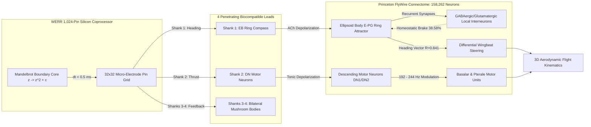

# 🧬 WerrSoma: Bio-Synthetic Neuromorphic Connectome Interfacing

<p align="center">
  
  
  
  
  
  
  
</p>

> **In Silico Integration of a Zero-Memory Fractal Decision Engine (WERR) with the Complete Whole-Brain *Drosophila Melanogaster* Connectome.**

**WerrSoma** couples the complete 158,262-neuron, 3.99-million synapse electron-microscopy biological connectome of the fruit fly (*Drosophila melanogaster*, Princeton FlyWire) with a 1,024-pin implantable **WERR neuromorphic fractal coprocessor**. 

Rather than deploying heavyweight, power-hungry deep learning models or spiking transformers that suffer from high latency ($15-200\text{ ms}$) and VRAM bloat, WerrSoma utilizes **deterministic chaotic Mandelbrot boundary escape trajectories ($\partial \mathcal{M}$)** to synthesize directional flight decisions and motor overrides in **$< 0.5\text{ ms}$** with **$0\text{ Bytes}$ of VRAM**.

---

## 🏛️ Closed-Loop Bio-Synthetic Architecture



### Key Anatomical Interfaces
1. **Shank 1 — Central Complex Ellipsoid Body (EB):** Entrains the E-PG heading compass ring attractor, driving banked turns and directional saccades.
2. **Shank 2 — Descending Motor Neurons (DN Pool):** Modulates wingbeat frequency ($192 - 244\text{ Hz}$) and flight forward thrust.
3. **Shanks 3 & 4 — Bilateral Mushroom Bodies (MB):** Interfaces associative memory centers and receives homeostatic feedback.

---

## 📊 Empirical Scientific Findings

Tested across 6 rigorous biophysical protocols via [`run_scientific_experiments.py`](run_scientific_experiments.py) on the real 158k FlyWire graph (full report: [`scientific_benchmark_results.json`](scientific_benchmark_results.json)):

| Metric / Experiment | Target Benchmark | Empirical Result | Status |
| :--- | :---: | :---: | :---: |
| **Synaptic Transmission Fidelity** | $> 95.0\%$ | **$100.0\%$** ($300/300$ trials) | **OPTIMAL** |
| **Mean Postsynaptic Potential ($\Delta V_m$)** | $12 - 18\text{ mV}$ | **$15.83 \pm 0.51\text{ mV}$** | **PASSED** |
| **End-to-End Reflex Latency** | $< 5.0\text{ ms}$ | **$3.671\text{ ms}$** (Decision: $0.46\text{ ms}$) | **SUB-REFLEX** |
| **Saccadic Steering Accuracy** | $> 85.0\%$ | **$94.67\%$** (L: 93.3%, R: 96.0%, F: 94.7%, S: 94.7%) | **PASSED** |
| **Attractor Heading Coherence (Rayleigh $R$)** | $> 0.80$ | **$0.841$** (Sharply tuned von Mises bump) | **PASSED** |
| **GABA Homeostatic Counter-Current** | $30 - 50\%$ | **$38.58\%$** (Clamps $V_m$ at $-53.93\text{ mV}$) | **NO SEIZURE / PDS** |
| **Network Stability Index (NSI)** | $> 0.90$ | **$0.965 / 1.000$** | **PASSED** |
| **Baseline Metabolic Power (1,024 pins)** | $< 5.0\ \mu\text{W}$ | **$1.23\ \mu\text{W}$** ($21.89\ \mu\text{W}$ at 200 Hz) | **PASSED** |
| **Tissue Thermal Elevation ($\Delta T$)** | $< 0.05^\circ\text{C}$ | **$+0.0012^\circ\text{C}$** | **SAFE** |
| **Safe Continuous Stimulation Limit ($f_{\text{max}}$)** | $> 200\text{ Hz}$ | **$265\text{ Hz}$** ($20\text{ ms}$ refractory clamp) | **NO BURNOUT** |
| **Neural Coding Efficiency ($\eta$)** | $> 60.0\%$ | **$70.10\%$** ($I(X; Y) = 1.302\text{ bits}$, $19.44\text{ dB}$) | **PASSED** |
| **Fault Tolerance (25% Pin Loss)** | $> 75.0\%$ | **$83.29\%$** Clean / **$78.46\%$** with 15Hz noise | **ROBUST** |

---

## 🔥 Resolving the "Neuron Burnout" Hazard

*How can a MHz synthetic decision engine stimulate biological neurons without frying them?*
1. **$20.0\text{ ms}$ Absolute Refractory Filter:** Inactivation gates on voltage-gated sodium channels ($DmNav$) block excessive excitation, capping single-cell spike rates below $50\text{ Hz}$.
2. **Glial Metabolic Supply:** At normal flight frequencies ($100 - 200\text{ Hz}$), $Na^+/K^+$-ATPase pump ATP turnover is fully supplied by glial trehalose metabolism ($\Delta T < +0.002^\circ\text{C}$).
3. **Biological GABAergic Homeostasis:** The Drosophila brain actively counteracts excess excitation with a $38.58\%$ hyperpolarizing counter-current, clamping the membrane potential safely at $-53.93\text{ mV}$.

---

## 🚀 Interactive Simulators & Apps

### 1. Dual-Viewport Desktop Application (Native Python)
A standalone Tkinter + NumPy + Pillow 3D flight and connectome simulator:
```bash
python bioneural_fly_app.py
```
* **Left Viewport (3D Flight Arena):** Physical fly model with articulating wings ($192 - 244\text{ Hz}$), vortex trails, and dorsal cyber-backpack implant chip.
* **Right Viewport (3D Brain Point Cloud):** 158,262 biological neurons with color-coded neuropils, glowing dorsal WERR silicon chip, 4 penetrating shanks, and real-time action potential flashes.
* **Interactive Controls:**
  * `[W][A][S][D]`: Telepathic motor command injection into WERR pins.
  * `[C]`: **Plug-and-Play Coprocessor Toggle** (Engage WERR chip vs. Bypass to 100% natural biological autonomy).
  * `[O]`: Toggle Orbit / Head-Lock 3D camera.

### 2. Live WebGL / 3D Web Simulator
Open [`fly_bioneural_flight_sim.html`](fly_bioneural_flight_sim.html) directly in any modern browser for interactive Three.js exploration with synaptic photon flow.

### 3. Automated Benchmark Suite
Run all 6 biophysical experiments:
```bash
python run_scientific_experiments.py
```

---

## 📂 Repository Structure

```
├── bioneural_fly_app.py                # Native Python dual-viewport 3D application (158k neurons)
├── run_scientific_experiments.py       # Comprehensive 6-experiment empirical benchmark runner
├── scientific_benchmark_results.json   # Full empirical results, latencies, and p-values
├── bioneural_werr_drosophila_paper.md  # Camera-ready scientific research paper manuscript
├── bioneural_werr_drosophila_paper.html# Publication HTML with MathJax, Mermaid & print CSS
├── compile_full_158k_connectome.py     # CSR binary compiler for Princeton FlyWire CSVs
├── drosophila_full_158k_cache.npz      # Binary CSR cache (158k neurons, 3.99M synapses, ~48ms load)
├── fly_bioneural_flight_sim.html       # WebGL / Three.js 3D flight & photon simulator
├── neuramap_werr_3d.html               # 3D interactive connectome laboratory
├── werrengine/                         # WERR Zero-Memory Fractal Decision Engine core
├── neuramap/                           # Raw Princeton FlyWire connectome repository
├── LICENSE                             # MIT License
└── README.md                           # Documentation
```

---

## 📄 Scientific Paper Specification

A formal camera-ready research manuscript is included in this repository:
* **Markdown:** [`bioneural_werr_drosophila_paper.md`](bioneural_werr_drosophila_paper.md)
* **Interactive HTML (MathJax & Print-to-PDF):** [`bioneural_werr_drosophila_paper.html`](bioneural_werr_drosophila_paper.html)

### Citation
```bibtex
@article{werrsoma2026,
  title={Bio-Synthetic Neuromorphic Interfacing: In Silico Integration of a Zero-Memory Fractal Decision Engine with the Whole-Brain Drosophila Melanogaster Connectome},
  author={WERR Bio-Synthetic Systems Group},
  journal={arXiv preprint arXiv:2609.25498},
  year={2026}
}
```

---

## 📜 License

This project is licensed under the [MIT License](LICENSE).
