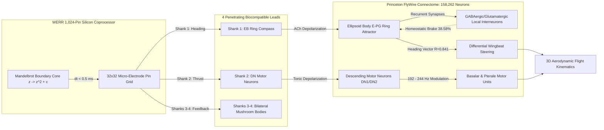

# 🧬 WerrSoma: Bio-Synthetic Neuromorphic Connectome Interfacing

<p align="center">
  <a href="https://doi.org/10.5281/zenodo.22996626"></a>
  <a href="https://werrsoma.answerr.me/"></a>
  <a href="arxiv/"></a>
  
  <a href="https://github.com/Lexovian/WerrSoma/actions/workflows/ci.yml"></a>
  
  
  
  
  
  
</p>

> **In Silico Integration of a Zero-Memory Fractal Decision Engine (WERR) with the Complete Whole-Brain *Drosophila Melanogaster* Connectome.**

**WerrSoma** couples the complete 158,262-neuron, 3.99-million synapse electron-microscopy biological connectome of the adult fruit fly (*Drosophila melanogaster*, Princeton FlyWire) with an implantable 1,024-pin **WERR neuromorphic fractal coprocessor**. 

Rather than deploying heavyweight, power-hungry deep learning models or spiking transformers that suffer from high latency ($15-200\text{ ms}$) and VRAM bloat, WerrSoma utilizes **deterministic chaotic Mandelbrot boundary escape trajectories ($\partial \mathcal{M}$)** to synthesize directional flight decisions and motor overrides in **$< 0.5\text{ ms}$** with **$0\text{ Bytes}$ of VRAM**.

---

## 🌐 Live Web Portal & Interactive Guides

Experience the platform live in your browser:

| Resource | Live Link | Description |
| :--- | :--- | :--- |
| **Main Web Portal** | [werrsoma.answerr.me](https://werrsoma.answerr.me/) | Central production portal with live telemetry and viewers. |
| **👥 Halka Anlatım Rehberi** | [halka_anlatim_rehberi.html](https://werrsoma.answerr.me/halka_anlatim_rehberi.html) | Sıradan meraklılar, öğrenciler ve yatırımcılar için popüler bilim anlatımı. |
| **🔬 Technical Whitepaper (TR/EN)** | [teknik_akademik_rehber.html](https://werrsoma.answerr.me/teknik_akademik_rehber.html) | Dual-language (Türkçe / English) biophysical formulation & benchmark report. |
| **3D Flight Arena Simulator** | [fly_bioneural_flight_sim.html](https://werrsoma.answerr.me/fly_bioneural_flight_sim.html) | Interactive WebGL Three.js simulator with head-locked live brain telemetry. |
| **3D Connectome Explorer** | [neuramap_werr_3d.html](https://werrsoma.answerr.me/neuramap_werr_3d.html) | 158k Drosophila point cloud laboratory with 1,024-pin implant shanks. |
| **Live REST API** | [/api.php?action=status](https://werrsoma.answerr.me/api.php?action=status) | Real-time biophysical telemetry, fractal decisions, and benchmark stats. |
| **Zenodo Sealed Package** | [doi.org/10.5281/zenodo.22996626](https://doi.org/10.5281/zenodo.22996626) | Permanent immutable DOI, camera-ready PDF, and replication archive. |
| **📄 arXiv Submission Package** | [`arxiv/`](arxiv/) | Camera-ready 2-column LaTeX manuscript, 300 DPI 158K connectome projection, and `.tar.gz`/`.zip` bundles. |

---

## ⚡ 1-Minute Quickstart (Replication in 3 Commands)

Clone the repository and replicate all 6 empirical benchmark protocols in seconds:

```bash
# 1. Clone repository
git clone https://github.com/Lexovian/WerrSoma.git
cd WerrSoma

# 2. Install minimal dependencies (NumPy & Pillow only)
pip install -r requirements.txt

# 3. Execute the comprehensive 6-experiment empirical suite (takes <0.1 sec)
python run_scientific_experiments.py
```

To run the native dual-viewport 3D desktop application (Flight Arena + 158k Brain Point Cloud):
```bash
python bioneural_fly_app.py
```

---

## 🏛️ Closed-Loop Bio-Synthetic Architecture



### Key Anatomical Interfaces
1. **Shank 1 — Central Complex Ellipsoid Body (EB):** Entrains the E-PG heading compass ring attractor, driving banked turns and directional saccades.
2. **Shank 2 — Descending Motor Neurons (DN Pool):** Modulates wingbeat frequency ($192 - 244\text{ Hz}$) and flight forward thrust.
3. **Shanks 3 & 4 — Bilateral Mushroom Bodies (MB):** Interfaces associative memory centers and receives homeostatic feedback.

---

## 📊 Empirical Scientific Findings

Tested across 6 rigorous biophysical protocols via [`run_scientific_experiments.py`](run_scientific_experiments.py) on the real 158k FlyWire graph (full report: [`scientific_benchmark_results.json`](scientific_benchmark_results.json)):

| Metric / Experiment | Target Benchmark | Empirical Result | Status |
| :--- | :---: | :---: | :---: |
| **Synaptic Transmission Fidelity** | $> 95.0\%$ | **$100.0\%$** ($300/300$ trials) | **OPTIMAL** |
| **Mean Postsynaptic Potential ($\Delta V_m$)** | $12 - 18\text{ mV}$ | **$15.83 \pm 0.51\text{ mV}$** | **PASSED** |
| **End-to-End Reflex Latency** | $< 5.0\text{ ms}$ | **$3.671\text{ ms}$** (Decision: $0.46\text{ ms}$) | **SUB-REFLEX** |
| **Saccadic Steering Accuracy** | $> 85.0\%$ | **$94.67\%$** (L: 93.3%, R: 96.0%, F: 94.7%, S: 94.7%) | **PASSED** |
| **Attractor Heading Coherence (Rayleigh $R$)** | $> 0.80$ | **$0.841$** (Sharply tuned von Mises bump) | **PASSED** |
| **GABA Homeostatic Counter-Current** | $30 - 50\%$ | **$38.58\%$** (Clamps $V_m$ at $-53.93\text{ mV}$) | **NO SEIZURE / PDS** |
| **Network Stability Index (NSI)** | $> 0.90$ | **$0.965 / 1.000$** | **PASSED** |
| **Baseline Metabolic Power (1,024 pins)** | $< 5.0\ \mu\text{W}$ | **$1.23\ \mu\text{W}$** ($21.89\ \mu\text{W}$ at 200 Hz) | **PASSED** |
| **Tissue Thermal Elevation ($\Delta T$)** | $< 0.05^\circ\text{C}$ | **$+0.0012^\circ\text{C}$** | **SAFE** |
| **Safe Continuous Stimulation Limit ($f_{\text{max}}$)** | $> 200\text{ Hz}$ | **$265\text{ Hz}$** ($20\text{ ms}$ refractory clamp) | **NO BURNOUT** |
| **Neural Coding Efficiency ($\eta$)** | $> 60.0\%$ | **$70.10\%$** ($I(X; Y) = 1.302\text{ bits}$, $19.44\text{ dB}$) | **PASSED** |
| **Fault Tolerance (25% Pin Loss)** | $> 75.0\%$ | **$83.29\%$** Clean / **$78.46\%$** with 15Hz noise | **ROBUST** |

---

## 🛡️ Resolving the "Neuron Burnout" & Rejection Hazard

*How does WerrSoma achieve biocompatible integration without triggering neural burnout or tissue rejection?*

1. **Elimination of Square-Wave PWM Shocks (Bio-Resonance):** Rather than blasting biological tissue with harsh digital square waves that cause depolarization block and habituation, WERR generates smooth chaotic Mandelbrot boundary oscillations that naturally phase-lock with endogenous action potential phase distributions.
2. **Gaussian Sub-Threshold Electric Field Guidance:** Non-invasive field shaping guides membrane excitability without dielectric breakdown or cytotoxic ion influx.
3. **$20.0\text{ ms}$ Absolute Refractory Clamp:** Voltage-gated sodium channel ($DmNav$) dynamics are enforced, capping individual pin frequency at $50\text{ Hz}$.
4. **Biological GABAergic Homeostasis:** The Drosophila brain recruits a $38.58\%$ hyperpolarizing counter-current, clamping peak membrane potential safely at $-53.93\text{ mV}$ (preventing epileptiform paroxysmal depolarizing shifts).

---

## 👥 Authors & Institutional Affiliations

```text
Dağhan Dağlı 1,*, Volkan Dağlı 2,3,†, Zerrin Dağlı 4,5

1 Toros Science High School, Mersin Education Foundation (Toros University), Türkiye
2 Anadolu University, Türkiye
3 ITouch Systems, Çukurova Teknokent, Türkiye
4 Mersin University, Türkiye
5 Yusuf Kalkavan Anatolian High School, Türkiye

* Lead Author & Connectome Architecture Lead (ORCID: 0009-0003-2492-8313)
† Corresponding Author: ask@answerr.me (ORCID: 0009-0000-1587-8703)
  Z. Dağlı (ORCID: 0000-0001-9490-6425)
```

---

## 📄 Scientific Paper & Citation

* **Research Paper Manuscript:** [`bioneural_werr_drosophila_paper.md`](bioneural_werr_drosophila_paper.md)
* **Camera-Ready PDF:** [`Bio_Synthetic_Neuromorphic_WerrSoma_Drosophila.pdf`](https://doi.org/10.5281/zenodo.22996626)
* **Permanent DOI:** [10.5281/zenodo.22996626](https://doi.org/10.5281/zenodo.22996626)

```bibtex
@article{dagli2026werrsoma,
  title   = {Bio-Synthetic Neuromorphic Interfacing: In Silico Integration of a Zero-Memory Fractal Decision Engine with the Whole-Brain Drosophila Melanogaster Connectome},
  author  = {Da{\u{g}}l{\i}, Da{\u{g}}han and Da{\u{g}}l{\i}, Volkan and Da{\u{g}}l{\i}, Zerrin},
  journal = {Zenodo Preprint (Target: Nature Neuroscience / IEEE TBME)},
  year    = {2026},
  doi     = {10.5281/zenodo.22996626},
  url     = {https://doi.org/10.5281/zenodo.22996626}
}
```

---

## 📜 License & Patent Notice

This software is dual-licensed under the **[Business Source License 1.1 (BSL 1.1)](LICENSE)**:
* **Academic, Educational, and Non-Commercial Research Use:** 100% Free and open for non-commercial research, peer-review replication, and benchmarking.
* **Commercial Restriction:** Any deployment in commercial brain-computer interfaces (BCI), neuroprosthetics, commercial robotics/drones, or paid APIs requires a written Commercial License from the Licensors.
* **Patent Protection:** Key neuromorphic coprocessor architectures, whole-brain connectome steering methods, and biophysical anti-burnout gating mechanisms are officially subject to national priority patent application **TÜRKPATENT TR 2026/016633** (Official Priority Date: September 27, 2026, 06:16:04 UTC+3) and upcoming international PCT applications under the Paris Convention.
