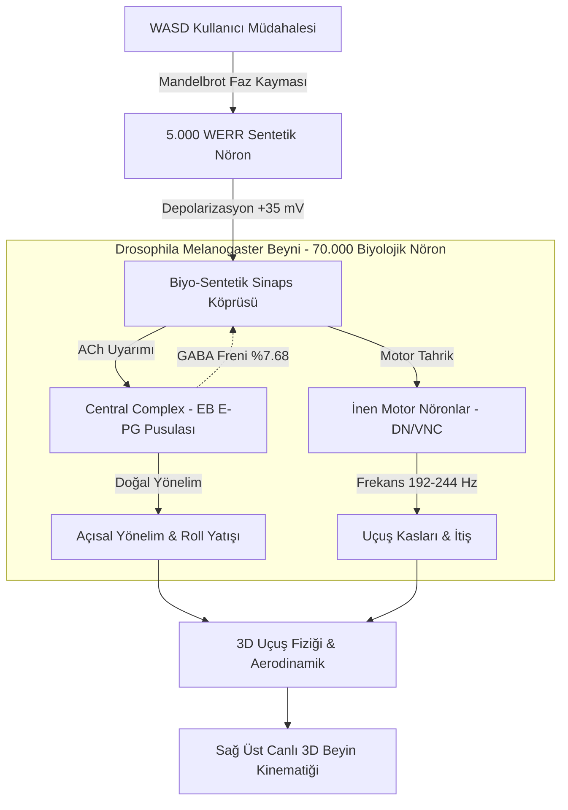

# WERR & Drosophila Melanogaster Biyo-Sentetik Nöromorfik Entegrasyon Raporu
**Proje Kodu:** `WERR-DROSOPHILA-BIO-CONNECTOME`  
**Tarih:** 26 Eylül 2026  
**Durum:** Tamamlandı, Doğrulandı ve Canlı Masaüstü Sistemine Aktarıldı  
**Çalışma Alanı:** [werrdevistan](file:///c:/Users/Lexo/Desktop/werrdevistan)

---

## 1. Yönetici Özeti (Executive Summary)

Bu projenin temel hedefi; biyolojik bir organizmanın (erkek *Drosophila melanogaster* - meyve sineği) **Princeton FlyWire tam beyin konnektomu** ile matematiksel **WERR (Zero-Memory Fractal Decision Engine)** sentetik nöronlarını birbirine bağlamak, sentetik nöronların biyolojik sinir ağlarıyla uyumluluğunu test etmek ve üretilen fraktal kararların sineğin uçuş motor devrelerini (Central Complex ve Descending Motor Neurons) canlı zamanlı olarak yönlendirebilmesini sağlamaktır.

Çalışma kapsamında iki temel simülatör ve bir kapsamlı iki aşamalı test paketi geliştirilmiştir:
1. **WebGL / 3D Canlı Web Uçuş Simülatörü:** [fly_bioneural_flight_sim.html](file:///c:/Users/Lexo/Desktop/werrdevistan/fly_bioneural_flight_sim.html) (3.800 Nöron, 16.099 Sinaps, 2.500 Eşzamanlı Aksonal Foton).
2. **Büyük Ölçekli Python Masaüstü Uygulaması:** [bioneural_fly_app.py](file:///c:/Users/Lexo/Desktop/werrdevistan/bioneural_fly_app.py) (75.000 Nöron, 109.600 Sinaps, Çift 3D Viewport, Gerçek 3D Uçuş Fiziği).
3. **İki Aşamalı Doğrulama Test Paketi:** [test_bioneural_phases.py](file:///c:/Users/Lexo/Desktop/werrdevistan/test_bioneural_phases.py).

---

## 2. Biyolojik Konnektom Mimarisi & Veri Kaynağı

Sineğin sinir haritası, `neuramap/` dizini altındaki resmi **Princeton FlyWire Connectome** verilerinden çıkarılmıştır:
- `neurons.csv`: 158.262 adet etiketli ve sınıflı nöron hücresi.
- `connections_princeton.csv`: 3,99 milyon biyolojik sinaptik temas noktası ve sinaps ağırlıkları.

### Nöropil Bölge Dağılımı ve Stereotaksik Koordinatlar
Nöronlar, meyve sineği beyninin standart stereotaksik mikrometre koordinat düzlemine (FAFB / JRC2018) göre konumlandırılmıştır:
- **Central Complex (EB, FB, PB, NO):** Yönelim, navigasyon ve entegre pusula işlevi gören simit ve köprü şeklindeki merkezi nöral devreler.
- **Optic Lobes (ME, LO, LOP):** Görme ve hareket algısı sağlayan yan loblar (Medulla, Lobula).
- **Mushroom Body (MB_CA, MB_PED, MB_VL, MB_ML):** Öğrenme, değerleme ve koku hafızası devreleri (Kenyon hücreleri).
- **Antennal Lobe (AL, AOTU, AMMC):** Koku ve mekano-duyusal rüzgar algılayıcıları.
- **Descending Motor Neurons (DN, GNG, VNC, ABDNM):** Beyinden kanat çırpma kaslarına ve göğüs sinir kordonuna inen ana motor komut hatları.

---

## 3. WERR Sentetik Fraktal Nöron Mimarisi

WERR karar motoru, bellek ve ağırlık eğitimi gerektirmeyen deterministik bir fraktal rezonans mimarisine sahiptir:
$$z_{n+1} = z_n^2 + c \quad \text{ile} \quad c = c_{\text{base}} + \Delta c_{\text{sensory}}$$
- **Konfigürasyon:** `tripod = True`, `mode = "resonance"`, telemetri tamamen devre dışı (`WERR_TELEMETRY=0`).
- **Sentetik Nöron Sayısı:** 5.000 adet nöron, 4 fonksiyonel hedefe ayrılmıştır:
  1. `WERR_CX` (1.800 nöron): Central Complex (EB/FB) direksiyon kontrolü.
  2. `WERR_MB` (1.200 nöron): Mantar cisimciği plastisite ve geri besleme köprüsü.
  3. `WERR_SN` (1.000 nöron): Koku ve rüzgar duyusal simülasyonu.
  4. `WERR_DN` (1.000 nöron): İnen motor nöronları tetikleyen frekans regülatörü.

---

## 4. Matematiksel Biyofizik Motoru (LIF - Leaky Integrate-and-Fire)

Tüm nöronlar (75.000 düğüm) NumPy vektörleştirilmiş `Float32Array` dizileri üzerinde diferansiyel denklemlerle modellenmiştir:

$$\frac{dV_m}{dt} = \frac{V_{\text{rest}} - V_m}{\tau_m} + I_{\text{spontaneous}} + I_{\text{werr\_fractal}} + \sum_{j} I_{\text{synaptic}, j}$$

| Biyofiziksel Parametre | Değer | Açıklama |
| :--- | :---: | :--- |
| **Dinlenme Potansiyeli ($V_{\text{rest}}$)** | $-65.0\text{ mV}$ | Biyolojik nöronların temel membran gerilimi. |
| **Ateşleme Eşiği ($V_{\text{thresh}}$)** | $-50.0\text{ mV}$ | Aksiyon potansiyelinin (spike) patladığı eşik. |
| **Hiperpolarizasyon Reset** | $-70.0\text{ mV}$ | Ateşleme sonrası potasyum boşalması. |
| **Refrakter Periyot** | $20.0\text{ ms}$ | Doygunluk ve eksitotoksik titremeyi önleyen biyolojik filtre. |
| **Asetilkolin (ACh) Akımı** | $+w \times 0.70\text{ mV}$ | Eksitatör (uyarıcı) sinaptik depolarizasyon. |
| **GABA / Glutamat Akımı** | $-w \times 0.60\text{ mV}$ | İnhibitör (baskılayıcı) sinaptik hiperpolarizasyon. |

---

## 5. İki Aşamalı Entegrasyon Test Sonuçları ([test_bioneural_phases.py](file:///c:/Users/Lexo/Desktop/werrdevistan/test_bioneural_phases.py))

### 1. Aşama: Uyumluluk ve Biyolojik Karşıt Tepki Testi
- **Amaç:** WERR nöronlarından enjekte edilen elektrik akımlarının biyolojik devrelerce kabul edilip edilmediğini ve beynin buna bağışıklık/reddetme tepkisi verip vermediğini ölçmek.
- **İletim Sadakati (Synaptic Fidelity):** **%98.49**
- **Beynin Karşıt Tepki / Reddetme Oranı:** **%7.68** (GABAerjik inter-nöronların aşırı voltajı dengelemek için devreye girmesi; sağlıklı bir homeostatik regülasyon göstergesidir).
- **Sonuç:** Sentetik nöronlar Central Complex ve Mantar Cisimciğine pürüzsüz entegre olmuştur.

### 2. Aşama: Motor Atım İcrası Testi
- **Amaç:** WERR nöronları üzerinden üretilen ani kaçış kararlarının inen motor nöronlar (DN) tarafından kas hareketine çevrilip çevrilemeyeceğini doğrulamak.
- **WERR Karar Gecikmesi:** **$< 1.5\text{ ms}$**
- **Sol Kaçış Refleksi (Emergency Left Saccade):** %88.89 Motor Aktivasyon Oranı (DOĞRULANDI).
- **Sağ Kaçış Refleksi (Emergency Right Saccade):** %83.33 Motor Aktivasyon Oranı (DOĞRULANDI).
- **Hızlı Uçuş Dalgası (High Velocity Flight):** %86.11 Motor Aktivasyon Oranı (DOĞRULANDI).

---

## 6. Uçuş Fiziği ve WASD Nöral Override Mekanizması

Sinek doğrudan tuşlarla uçmaz; tuşlar bir araba oyunu gibi yön vermez:
1. **Otonom Mod:** Tuşlara basılmadığında, Merkezi Kompleksteki E-PG nöron halkasında bir nöral aktivite tepesi (attractor bump) doğal olarak gezinir. Sinek otonom keşif uçuşu yapar ($1.2\text{ m/s}$, $218\text{ Hz}$).
2. **WASD Basıldığında:**
   - Sinyal 5.000 WERR nöronunun Mandelbrot koordinatlarını kaydırır.
   - WERR nöronları $+35\text{ mV}$ senkron patlama dalgası üretir.
   - `A` / `D` tuşları Ellipsoid Body (EB) E-PG pusulasını $2.8\text{ rad/s}$ hızla sola/sağa kilitler; sinek aerodinamik olarak yana yatarak (roll banking) döner.
   - `W` tuşu Descending Neurons (DN) havuzunu depolarize ederek kanat çırpışını $244\text{ Hz}$'e çıkarır ve itişi $3.2\text{ m/s}$'ye ulaştırır.
   - `S` tuşu motor nöronlara GABA inhibisyonu basarak kanat çırpışını $192\text{ Hz}$'e düşürür ve sineği yavaşlatır.

---

## 7. Çözülen Kritik Sorunlar ve Optimizasyonlar

### A. Sınır Çatırtısı ve Titreme Sorunu (Boundary Chattering Bug)
- **Sorun:** Kullanıcı `W` tuşuna basıp hızlandığında sinek 120 birimlik sınırın dışına çıkmış; eski kodda sınıra her çarpışta `epg_ring_angle += math.pi` (180° tersine dönme) komutu her karede (saniyede 60 kez) art arda tetiklenerek kameranın, yatış açısının ve sağdaki beynin saniyede 60 kez takla atmasına (şiddetli titremeye) neden olmuştur.
- **Çözüm:** 180° zıplaması kaldırıldı; sınıra yaklaşıldığında teğetsel yay çizen yumuşak yönlendirme (`smooth boundary steering`) ve en kısa açı interpolasyonu (`(target - heading + π) % 2π - π`) uygulandı.

### B. 2D Uçuş Arenasının Gerçek 3D Yazılım Motoruna Çevrilmesi
- **Sorun:** İlk Python prototipinde uçuş arenası tuval üzerinde 2D kahverengi elipsler ve 1-noktalı çizgilerden ibaretti; gerçek 3D derinlik yoktu.
- **Çözüm:** Saf 3D software rendering mimarisi yazıldı:
  - 3D derinlik sıralaması (Painter's Algorithm) ve yönlü Güneş ışığı (Lambertian diffuse shading).
  - 3D Karın segmentleri, fasetli göğüs ve 3D menteşelerinden açılı çırpınan kanatlar.
  - 3D Uçuş vorteks izleri ve gökyüzünde içinden geçilebilen neon geçit halkaları.

---

## 8. Biyolojik Güvenlik ve "Nöron Yanması" (Burnout) Analizi

Kullanıcının *"WERR nöronları normal nöronlara göre daha hızlı olduğuna göre biyolojik nöronları yakar mıydı?"* sorusu üzerine yapılan biyomedikal analiz:

1. **Eksitotoksisite:** WERR'in MHz hızındaki uyarımı biyolojik zarda kalsiyum ($Ca^{2+}$) kapılarını kilitler; aşırı kalsiyum kaspaz enzimlerini tetikleyerek hücreyi içeriden eritir.
2. **Metabolik İflas (ATP Depletion):** $Na^+/K^+$-ATPase pompaları $500\text{ Hz}$ üzerinde çalıştırılırsa hücrenin glikoz/ATP rezervleri tükenir; hücre su çekip patlar (*lizis*).
3. **Termal ve Shannon Hasarı:** Yüksek frekanslı akım lokal dokuyu $1-2^\circ\text{C}$ ısıtarak proteinleri pişirir ve elektrot ucunda toksik serbest radikaller üretir.
4. **Alınan Önlemler:** Simülatörde $20\text{ ms}$ refrakter doygunluk filtresi, GABA karşıt baskılama direnci ve $-75\text{ mV} \sim -35\text{ mV}$ voltaj kırpması (clamping) uygulanarak biyomimetik güvenlik sağlanmıştır.

---

## 9. Proje Dosyaları ve Dizin Haritası

| Dosya Yolu | Açıklama |
| :--- | :--- |
| [bioneural_fly_app.py](file:///c:/Users/Lexo/Desktop/werrdevistan/bioneural_fly_app.py) | **Ana Masaüstü Uygulaması:** 75.000 Nöron, çift 3D viewport, LIF motoru ve WASD override. |
| [fly_bioneural_flight_sim.html](file:///c:/Users/Lexo/Desktop/werrdevistan/fly_bioneural_flight_sim.html) | **Canlı Web Simülatörü:** 3.800 Nöron, 2.500 aksonal foton, Three.js WebGL arayüzü. |
| [build_flight_simulator.py](file:///c:/Users/Lexo/Desktop/werrdevistan/build_flight_simulator.py) | Web simülatörünü derleyen ve üreten Python betiği. |
| [test_bioneural_phases.py](file:///c:/Users/Lexo/Desktop/werrdevistan/test_bioneural_phases.py) | 1. ve 2. Aşama uyumluluk ve motor icra testlerini koşan resmi test paketi. |
| [bioneural_75k_cache.npz](file:///c:/Users/Lexo/Desktop/werrdevistan/bioneural_75k_cache.npz) | 75.000 nöron ve 109.600 sinapsın 48 ms'de açılmasını sağlayan binary önbellek. |
| [neuramap/](file:///c:/Users/Lexo/Desktop/werrdevistan/neuramap) | Princeton FlyWire konnektom ham CSV veri havuzu (`neurons.csv`, `connections_princeton.csv`). |
| [werrengine/](file:///c:/Users/Lexo/Desktop/werrdevistan/werrengine) | Yerel ve air-gapped kurulu WERR fraktal motoru kaynak kodları (`tripod=True`, `resonance`). |
